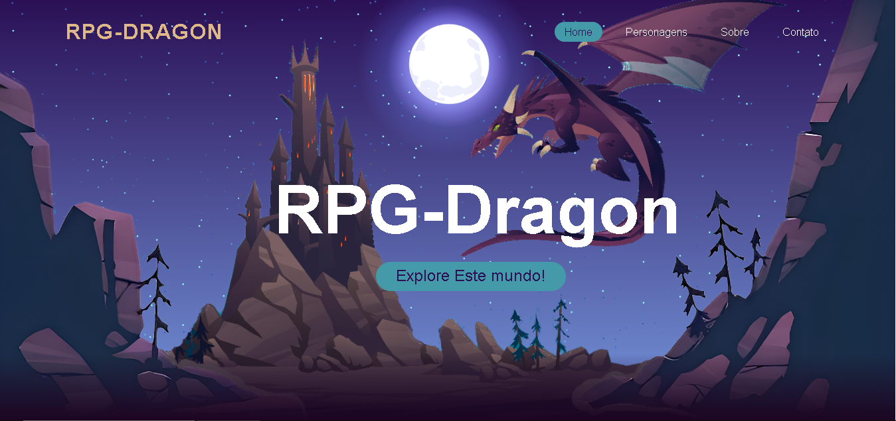
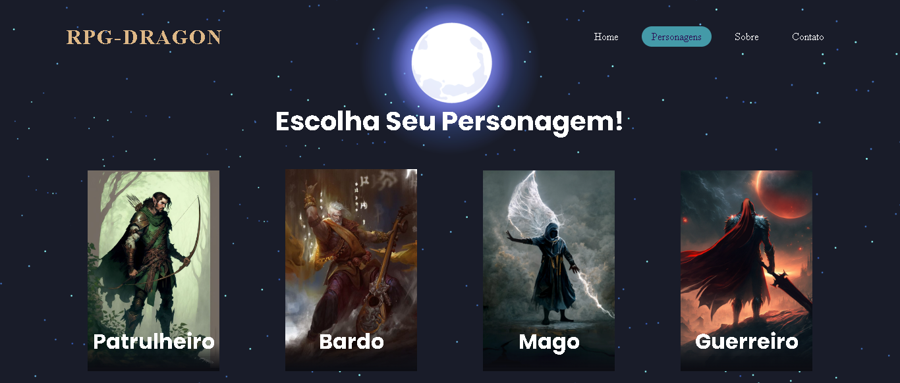
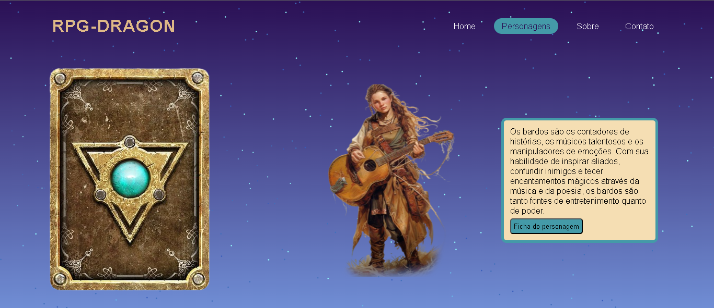

# FrontEnd Essencial - Grupo 2
 ## :detective: Índice

* Sobre o Projeto
* Tecnologias utilizadas
* Autores do Projeto

## Sobre o Projeto
O projeto visa o desenvolvimento de um site para um RPG, devendo ter um design atraente, ser interativo e responsivo.
O site conta com um menu explicando brevemente sobre o universo do RPG e uma página com os heróis da história.
Desenvolvemos também cards interativos que contam um pouco mais a história dos heróis, levando o usuário a criação da ficha de personagem.

O projeto foi realizado durante a disciplina de FrontEnd Essencial da Residência em TIC/Software do Serratec.

##  Tecnologias utilizadas
- HTML
- CSS
- Javascript

## Autores

- [Emmily](https://github.com/emmillyf)
- [Gabriel Pimentel](https://github.com/GabrielnPimentel)
- [Matheus Adriano Rodrigues](https://github.com/MatheusARodrigues)
- [Nicolas de Souza](https://github.com/Nicks-Souza)
- [Rafaela Costa](https://github.com/rafaelacostamg)
- [Victor Hugo Lisboa Machado](https://github.com/vintinls) 
 
